 

---

## 🛠️ Tech Stack

  

### Languages

### Backend & APIs

### Databases

### Caching, Messaging & Storage

### DevOps & Tools

### ML / CV / Research

### Web & Frontend

---

## 🔒 Cybersecurity

---

## 📂 Projects

| 🚀 Project | 🏷️ Tech | 📄 About |
|:-----------|:--------|:---------|
| [**egocentric-memory-reasoning**](https://github.com/prakhar060703/egocentric-memory-reasoning) |     | MTP research — VideoTree, EgoRAG, FIO pipelines for long-horizon video QA |
| [**Infollion_Spreadsheet_Engine**](https://github.com/prakhar060703/Infollion_Spreadsheet_Engine) |  | Spreadsheet engine with formula parsing and reactive cell dependency resolution |
| [**VideoTree_Inspired_Implementation**](https://github.com/prakhar060703/VideoTree_Inspired_Implementation) |    | Caption-based retrieval and reasoning over egocentric video |
| [**flexSQL**](https://github.com/prakhar060703/flexSQL) |  | SQL-like query engine built from scratch — parsing, execution, storage |
| [**Linux-Terminal-Emulator-with-X11**](https://github.com/prakhar060703/Linux-Terminal-Emulator-with-X11) |   | Terminal emulator with PTY, pipes, signal handling, job control, autocompletion |
| [**HydroScope_Delhi**](https://github.com/prakhar060703/HydroScope_Delhi) |     | Satellite rainfall analysis and forecasting for Delhi NCR |
| [**ParkOps_Management_System**](https://github.com/prakhar060703/ParkOps_Management_System) |    | Role-based parking backend with async jobs and REST APIs |
| [**recommended_system**](https://github.com/prakhar060703/recommended_system) |  | Recommendation system implementation |
| [**LinkVault**](https://github.com/prakhar060703/LinkVault) |  | Bookmark and link management tool |
| [**Searching_Visualizer**](https://github.com/prakhar060703/Searching_Visualizer) |  | Visual demo of searching algorithms |
| [**Vehicle_Parking_App**](https://github.com/prakhar060703/Vehicle_Parking_App) |  | Parking slot booking web app |
| [**colour-reduction-image**](https://github.com/prakhar060703/colour-reduction-image) |  | Image colour quantization using ML |

---

## 🤖 AI / ML / Computer Vision

### Frameworks & Libraries

### Computer Vision

### LLMs & Retrieval

### Classical ML & Time Series

### Infrastructure

---

